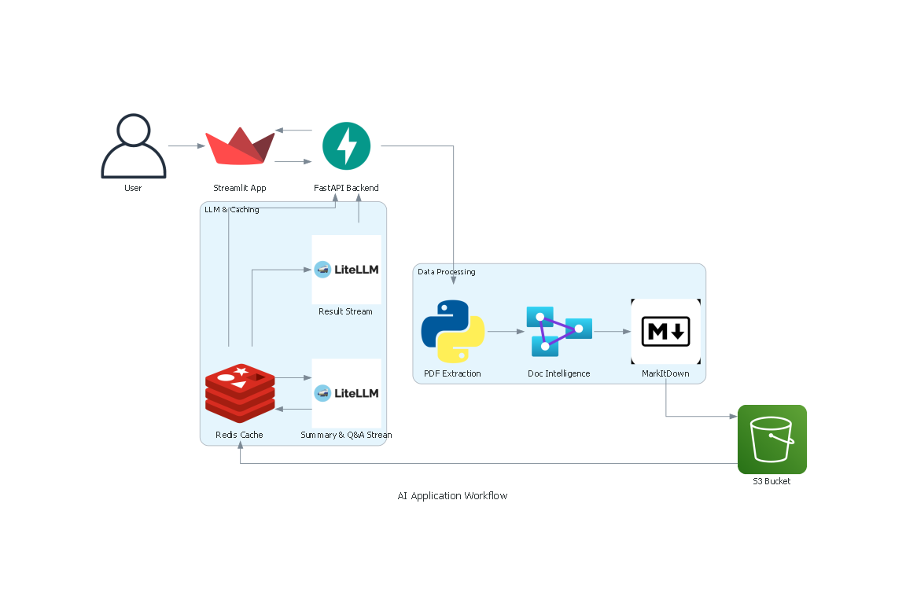

# LiteLLM_SummaryGenerator_with_Q-A


## Assignment Overview




1. **Develop a Streamlit web application** that:
   - Allows selection of previously parsed PDF content or new PDF files.
   - Utilizes **Large Language Models (LLMs)** like **GPT-4o** through **LiteLLM** to:
     - Provide **summaries** of the document content.
     - Answer **user-submitted questions** about the document content.

2. **Integrate FastAPI** to handle backend API interactions between **Streamlit and LLM services**.
3. **Implement and manage API integrations** with LiteLLM to simplify connections to **LLM providers**.

---

## Functional Requirements

### Front-End (Streamlit)
- **User-friendly interface** with the following features:
  - Select the **LLM of choice**.
  - Ability to select from prior parsed **PDF markdowns** or upload new PDF documents.
  - **Text input** for asking specific questions.
  - **Buttons** to trigger summarization and Q&A functionalities.
  - **Clear display areas** for showing generated summaries and answers.

### Back-End (FastAPI)
- **REST API endpoints** using **FastAPI** to manage requests from **Streamlit**:
  - `/select_pdfcontent` → Select prior **parsed PDF content**.
  - `/upload_pdf` → Accept new **PDF content**.
  - `/summarize` → Generate summaries.
  - `/ask_question` → Process **user questions** and return answers.
- Implement appropriate **JSON response formats** for communication.
- Use **Redis streams** for communication between **FastAPI and other services**.

### LiteLLM Integration
- Manage all **LLM API interactions** using LiteLLM.
- Document **pricing and token usage** for input and output queries.
- Implement **error handling and logging** for API calls.

---

## Deployment

- **Use Docker Compose** and deploy all components on the **cloud**.

---

## Deliverables

### 1. GitHub Repository
- **Well-organized and structured code**.
- **README.md** with detailed **setup instructions**.
- **Diagrammatic representations** of **architecture** and **data flows**.

### 2. Documentation and Reporting
- **AIUseDisclosure.md** → Transparent documentation of all **AI tools** used.
- **Task tracking** via **GitHub Issues**.
- **Technical and architectural diagrams**.
- **Final Codelab** with a **step-by-step implementation guide**.

---

## Supported LLM Models

| Number | Model | Documentation |
|--------|--------|----------------|
| 1 | GPT-4o | [OpenAI GPT-4o Documentation](https://platform.openai.com/docs/) |
| 2 | Gemini - Flash | [Google Gemini 2.0 Flash Documentation](https://ai.google.dev/) |
| 3 | DeepSeek | [DeepSeek LLM Documentation](https://deepseek.ai/) |
| 4 | Claude | [Anthropic Claude Documentation](https://www.anthropic.com/) |
| 5 | Grok | [xAI Grok Documentation](https://x.ai/) |

---

## Prerequisites

- **Python 3.7+**
- **Docker & Docker Compose**
- **Redis Server**
- **FastAPI & LiteLLM**
- **Streamlit**

---

## Installation

1. Clone the repository:
   ```bash
   git clone [repo_link]
   cd [repo_name]
   ```
2. Install dependencies:
   ```bash
   pip install -r requirements.txt
   ```
3. Start Redis:
   ```bash
   redis-server
   ```
4. Start FastAPI backend:
   ```bash
   uvicorn main:app --host 0.0.0.0 --port 8000
   ```
5. Start Streamlit frontend:
   ```bash
   streamlit run app.py
   ```

---

## Deployment with Docker

```bash
# Build and start services
docker-compose up --build -d
```

---

## Contributing

Contributions are welcome! Please open an **Issue** or submit a **Pull Request** on GitHub.

---
## Attestation and Contribution Declaration

**WE ATTEST THAT WE HAVEN’T USED ANY OTHER STUDENTS’ WORK IN OUR ASSIGNMENT AND ABIDE BY THE POLICIES LISTED IN THE STUDENT HANDBOOK.**

### Contribution Breakdown:
- **Member 1:** 33 1/3%
- **Member 2:** 33 1/3%
- **Member 3:** 33 1/3%

### GitHub Links:
- **Repository Link:** [Insert GitHub Repository Link]
- **Task Tracking:** [Insert GitHub Issues Link]
- **Task Ownership:** [List of tasks owned by each team member]

---
## License

This project is licensed under the **MIT License**. See the [LICENSE](LICENSE) file for details.

